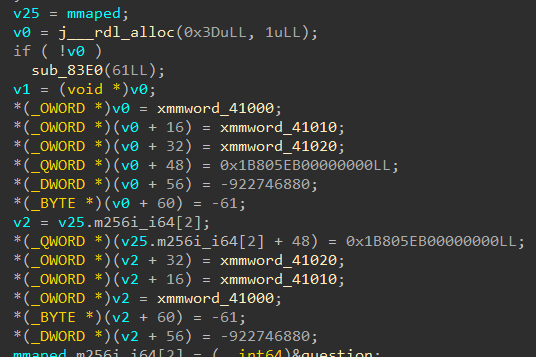

# Layers

> You have been assigned to investigate in the Cancer sector. For a few months, it seems that something is going on in the shadows: a kind of cult has appeared around an idol, a certain red crab still unknown to the scientists of the dial despite their research in the archives stored there. \
> Although it is risky, the best way to investigate this cult is to try to enter it directly. \
> To this end, you meet a guru of the cult who simply gives you a file on a USB key without saying a word...
> 
> **The flag to submit is in the format `HACKDAY{PASSWORD}`, i.e. the password surrounded by `HACKDAY{}`.**

## Static analysis

We start the challenge with a file, `layers`. Let's run `file` on it.

```
$ file layers
layers: ELF 64-bit LSB pie executable, x86-64, version 1 (SYSV), dynamically linked, interpreter /lib64/ld-linux-x86-64.so.2, for GNU/Linux 3.2.0, BuildID[sha1]=6febf177e554dd73111e182a7a34152e61814722, stripped
```

It's a classic x64 ELF binary for Linux, but it is stripped. \
Let's run it and see what it does.

```
$ ./layers
So, what did you understand about the idol?
> not that much tbh
Absolutely nothing happens... You're probably still missing something...
```

Okay, we probably have to find what input will make it say something successful. \
Let's open it in IDA and start our analysis. As usual, we go to the strings, search for a known string such as the failure message, and use its x-refs to jump to the right code. We also notice this is once again Rust code...


The least we can say is that it's actually really awful. The fact that the binary is stripped really makes everything a lot harder here. \
You can theoretically do the challenge by reversing the stripped version, but it takes time and is painful. To ease the reverse, you can use [Cerberus](https://github.com/h311d1n3r/Cerberus), a very nice tool that brings back some information about the functions. All the information regarding how it works can be found in its repository.

```
$ ./cerberus layers
[*] The following crates were found :
[+] - mmap: v0.1.1
[+] - gimli: v0.26.1
[+] - addr2line: v0.17.0
[+] - rustc-demangle: v0.1.21
[+] - miniz_oxide: v0.5.3
[*] Add/Edit/Remove crate ? (y/N):
[*] Downloading 5 crates...
[+] Done !
[*] Extracting crates from their archives...
[+] Done !
[*] Patching Cargo.toml files to produce shared libraries...
[+] Done !
[*] Building crates...
[?] An error occured when building crate miniz_oxide-0.5.3
[*] Delegating to BuildFixer...
[*] BuildFixer -> Applying patch : STD REDEFINITION
[*] BuildFixer -> Building crate again...
[+] BuildFixer -> Success !
[?] An error occured when building crate rustc-demangle-0.1.21
[*] Delegating to BuildFixer...
[*] BuildFixer -> Applying patch : STD REDEFINITION
[*] BuildFixer -> Building crate again...
[?] BuildFixer -> Build failed...
[*] BuildFixer -> Trying to patch new error trace...
[*] BuildFixer -> Applying patch : EDITION 2021
[*] BuildFixer -> Building crate again...
[+] BuildFixer -> Success !
[+] Done ! (5/5)
[*] Generating hash file for ELF target...
[+] Done ! Hashed 495 functions.
[*] Checking for matches in built crates...
[+] Done ! 486 matches.
[*] Patching to new ELF...
[+] Done !
[+] End of execution. ELF file layers-patched is your result.
$ file layers-patched
layers-patched: ELF 64-bit LSB shared object, x86-64, version 1 (SYSV), dynamically linked, interpreter /lib64/ld-linux-x86-64.so.2, for GNU/Linux 3.2.0, BuildID[sha1]=6febf177e554dd73111e182a7a34152e61814722, not stripped
$ ./layers-patched
So, what did you understand about the idol?
> idk
Absolutely nothing happens... You're probably still missing something...
```

The unstripped version looks much nicer, we have recovered a lot of function names. I have also renamed a few variables by hand.


We don't even need to reverse all of this. If we take a quick look at the end of the function, something is way more important than the rest.


The code seems to be executing something unusual computed at runtime, using the mmaped data. \
Looking at the assembly is even more obvious: we have an indirect call to whatever is stored in r14.


We also see that sooner in the function, it seems to be loading a lot of immediates in a variable. Remember, in Rust, successive immediates are often loaded as xmmwords for optimization.



Let's be lazy and use gdb to break at this call and see what it actually executes!

## Dynamic analysis

In gdb, the base address of the debuggee is always set to 0x555555554000. The `call r14` being at offset 0x8E2C, the address of this instruction is 0x55555555CE2C.

As we saw inside the assembly, values are moved to rdi, rsi, rdx and rcx before the call is made. These must be arguments to the call, because it matches the Linux x64 calling convention (rdi, rsi, rdx and rcx).


We can deduce that the arguments represent the following:

- the first one is the user input
- the second one is probably the user input length
- the third one is the address of something in memory, we don't know much
- the fourth one is 28, and we can guess it's the length of the third parameter

If we look at the memory rdx points to, we can see it indeed looks like an array of 28 elements!

```
pwndbg> x/28wx 0x7fffffffd670
0x7fffffffd670: 0x3c72501b      0x3c72523b      0x3c72515b      0x3c7250c3
0x7fffffffd680: 0x3c725223      0x3c725013      0x3c72523b      0x3c72515b
0x7fffffffd690: 0x3c72506b      0x3c725223      0x3c72500b      0x3c72515b
0x7fffffffd6a0: 0x3c72503b      0x3c72522b      0x3c7250d3      0x3c7250bb
0x7fffffffd6b0: 0x3c72522b      0x3c725033      0x3c72523b      0x3c7250c3
0x7fffffffd6c0: 0x3c72506b      0x3c72515b      0x3c725093      0x3c72523b
0x7fffffffd6d0: 0x3c725033      0x3c725033      0x3c72522b      0x3c72520b
```

Now that we have an idea of the arguments to the call, let's inspect the content in r14 and see what is the code executed here. The number of instructions to inspect is arbitrary.

```
pwndbg> x/30i $r14
   0x7ffff7fcb000:      push   rbp
   0x7ffff7fcb001:      mov    rbp,rsp
   0x7ffff7fcb004:      cmp    rsi,rcx
   0x7ffff7fcb007:      jne    0x7ffff7fcb02f
   0x7ffff7fcb009:      movzx  rax,BYTE PTR [rdi]
   0x7ffff7fcb00d:      xor    rbx,rbx
   0x7ffff7fcb010:      mov    ebx,DWORD PTR [rdx]
   0x7ffff7fcb012:      shl    rax,0x3
   0x7ffff7fcb016:      xor    rax,0x3c7253a3
   0x7ffff7fcb01c:      cmp    rax,rbx
   0x7ffff7fcb01f:      jne    0x7ffff7fcb02f
   0x7ffff7fcb021:      dec    rsi
   0x7ffff7fcb024:      je     0x7ffff7fcb036
   0x7ffff7fcb026:      inc    rdi
   0x7ffff7fcb029:      add    rdx,0x4
   0x7ffff7fcb02d:      jmp    0x7ffff7fcb009
   0x7ffff7fcb02f:      mov    eax,0x0
   0x7ffff7fcb034:      jmp    0x7ffff7fcb03b
   0x7ffff7fcb036:      mov    eax,0x1
   0x7ffff7fcb03b:      leave
   0x7ffff7fcb03c:      ret
   0x7ffff7fcb03d:      add    BYTE PTR [rax],al
   0x7ffff7fcb03f:      add    BYTE PTR [rax],al
   0x7ffff7fcb041:      add    BYTE PTR [rax],al
   0x7ffff7fcb043:      add    BYTE PTR [rax],al
   0x7ffff7fcb045:      add    BYTE PTR [rax],al
   0x7ffff7fcb047:      add    BYTE PTR [rax],al
   0x7ffff7fcb049:      add    BYTE PTR [rax],al
   0x7ffff7fcb04b:      add    BYTE PTR [rax],al
   0x7ffff7fcb04d:      add    BYTE PTR [rax],al
```

It is hopefully a very small function. It is easy to reverse it. \
If rsi and rcx are not equal, it returns 0. This confirms the idea that both are probably the length of the other arguments. \
Then, it takes a byte of our input, apply a left shift of 3 bits on it, xor it with `0x3c7253a3`, and compares the result with a dword from the other array. \
If the result matches, it continues until the end of our input, and it returns 1. \
If any of the comparisons fail, it returns 0.

We have everything we need!

## Reverse the comparison

All we have to do is take the values in the array, xor the back with `0x3c7253a3`, and right shift the result by 3.

```py
enc_array = [0x3c72501b, 0x3c72523b, 0x3c72515b, 0x3c7250c3, 0x3c725223, 0x3c725013, 0x3c72523b, 0x3c72515b, 0x3c72506b, 0x3c725223, 0x3c72500b, 0x3c72515b, 0x3c72503b, 0x3c72522b, 0x3c7250d3, 0x3c7250bb, 0x3c72522b, 0x3c725033, 0x3c72523b, 0x3c7250c3, 0x3c72506b, 0x3c72515b, 0x3c725093, 0x3c72523b, 0x3c725033, 0x3c725033, 0x3c72522b, 0x3c72520b]

valid_input = ""

for enc_char in enc_array:
    valid_input += chr((enc_char ^ 0x3c7253a3) >> 3)

print(valid_input)
```

Result:

```
$ python3 solve.py
w3_l0v3_y0u_s1nc1r3ly_f3rr15
```

Let's check it works in the program:

```
$ ./layers
So, what did you understand about the idol?
> w3_l0v3_y0u_s1nc1r3ly_f3rr15
You suddenly feel deep inside yourself a big feeling of satisfaction... You don't know precisely how, but you've figured out what the locals wanted to tell you about their culture.
```

We've done it! \
Flag: `HACKDAY{w3_l0v3_y0u_s1nc1r3ly_f3rr15}`