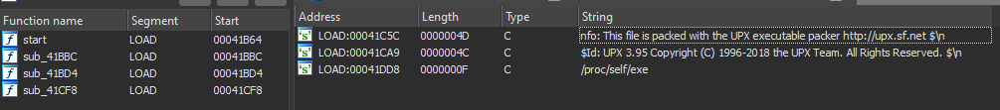
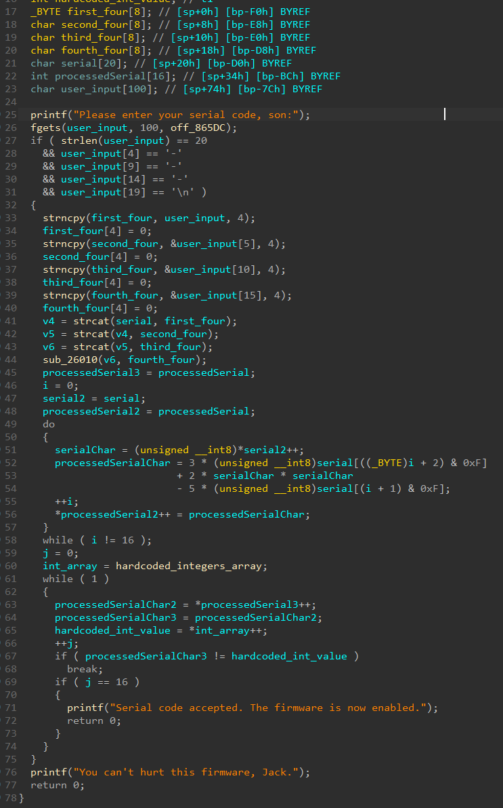
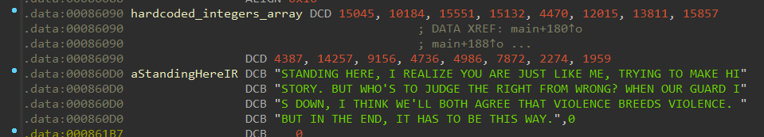

# Nanomachine

> The largest hospital in the Virgo sector has finally received its new stock of nanomachines needed to perform the most critical patient operations. \
> Unfortunately, the activation codes we received for the firmware of these nanomachines do not work, and the supplier does not answer our calls! \
> It is not feasible to delay the operations of the worst patients. Help us to activate this firmware!
> 
> **The flag is in the format `HACKDAY{XXXX-XXXX-XXXX-XXXX}`, where `XXXX-XXXX-XXXX-XXXX` is the serial code of the firmware.**

We start the challenge with a `nanomachine` file. First reflex, use `file` on it.

```
$ file nanomachine
nanomachine: ELF 32-bit LSB executable, ARM, EABI5 version 1 (GNU/Linux), statically linked, no section header
```

It's an ARM binary. As the challenge description implies it is an embedded program, it's not a surprise. \
Let's use [QEMU](https://www.qemu.org/) to run it and see what it actually does.

```
$ qemu-arm -L /usr/arm-linux-gnueabihf nanomachine
Please enter your serial code, son:
idk
You can't hurt this firmware, Jack.
```

Okay, so the binary is indeed asking for a serial code, and that's all. Our goal is probably to find the right serial. \
Let's open the file in IDA and start static analysis.

The first thing we notice is that there are only a few functions. If we look at the strings, they indicate that the binary is packed with upx. For an embedded program, it makes sense to use packers like upx to save a maximum of space.



We can unpack it using `upx -d`.

```
$ upx -d nanomachine
                       Ultimate Packer for eXecutables
                          Copyright (C) 1996 - 2018
UPX 3.95        Markus Oberhumer, Laszlo Molnar & John Reiser   Aug 26th 2018

        File size         Ratio      Format      Name
   --------------------   ------   -----------   -----------
    423296 <-    206804   48.86%    linux/arm    nanomachine

Unpacked 1 file.
```

Running another `file` on the unpacked binary tells us that the binary is unfortunately stripped AND statically linked, so we won't even have libc symbols.

```
$ file nanomachine
nanomachine: ELF 32-bit LSB executable, ARM, EABI5 version 1 (SYSV), statically linked, for GNU/Linux 3.2.0, BuildID[sha1]=8b0adc2bf3e2379f57b2b59d2badf0dc19a357c6, stripped
```

If we reopen the file in IDA, this time, there's a lot more to analyze. \
By looking at the strings, we find those that we identified when running the binary with QEMU. Using the x-refs on these, we find the function where everything seems to be happening.

Obviously, because the binary is stripped, all the variables and functions have by default generic names. \
The work here is as usual, analyzing what each function seems to be doing and how each variable is used, to get a proper understanding of the way the program works and rename everything with more appealing names. \
For simplicity and readability purposes, I'll only show how it looks like when this hard work is done and the code looks way cleaner.

The following pseudo code is what I have after reversing the function, renaming things and fixing the wrongly detected variable types.



As you can see, it's pretty easy to figure out what's going at that point. The program seems to be written in C, so no black magic from C++, Go or Rust is making the code look terrible. It's clean.

The first thing the program does is to make sure the user input is 20 characters long, and consist is of the form `XXXX-XXXX-XXXX-XXXX\n`. This is coherent with the given format flag.

It then proceeds to split the input in four parts of 4 characters, and then concatenate everything back together. Actually, the result is that it just places the serial code in another buffer of length 16, but without the `-` inside it. This is the buffer that is used after that for the main logic.

That's where the important part comes in. There is a loop that perform some math on the serial. From what we can see, for each character in the serial, it computes the following:

```
3 * serial[i + 2] + 2 * serial[i] * serial[i] - 5 * serial[i + 1]
```

And the result is placed in another buffer, that I called the processed serial.

The last step is another loop, where the processed serial is simply compared to an array of integers hardcoded in the binary, in the `.data` section. If the comparison is successful, the serial is accepted. \
Let's look at the hardcoded array. If we tell IDA that this is an array of length 16 and we display it as decimal, we get the following nice array of values.



**Note** : you can also see a nice string under that array. It actually is an easter egg, not used at any point in the program. If you don't have the reference, the challenge is entirely a reference to a well known [meme from Metal Gear Rising: Revengeance](https://youtu.be/RhMsboqMMzs). This string is actually the lyrics of [Armstrong's theme](https://youtu.be/75WTRdwHL2k). The challenge name had nothing to do with nanomites, this time...

Now that we fully understand how the program works, let's think about how we can find a serial that is accepted.

The equation we need to solve is complicated. Too complicated to do by hand for sure. For this task, we can use [Z3](https://github.com/Z3Prover/z3) to do the hard work for us. \
We just have to describe the constraints we have, and Z3 will try its best to solve the equations as it can and give us a possible solution.

Here is my script:

```py
from z3 import *

enc = [15045, 10184, 15551, 15132, 4470, 12015, 13811, 15857, 4387, 14257, 9156, 4736, 4986, 7872, 2274, 1959]
mod = len(enc)

s = Solver()

chars = [Real(f"c{i}") for i in range(0, mod)]

for i in range(mod):
    code = chars[i]
    next_code = chars[(i + 1) % mod]
    next_next_code = chars[(i + 2) % mod]

    s.add(2 * (code ** 2) - 5 * next_code + 3 * next_next_code == enc[i])
    

if s.check() == sat:
    model = s.model()
    serial = "".join(map(chr, [model[c].as_long() for c in chars]))
    flag = "HACKDAY{" + "-".join([serial[i:i+4] for i in range(0, len(serial), 4)]) + "}"
    print(flag)
```

**Note** : the use of `Real` instead of `Int` here is very important, even though the input we're searching must be integers! Using reals instead of integers will make Z3 use a different solver. For some reason, with the solver used for integers, the constraints seems to be somehow too hard for the solver, because it takes forever to run. See [here](https://microsoft.github.io/z3guide/docs/theories/Arithmetic/) for more details.

If we run the script, we get after a few seconds:

```
$ python3 solve.py
HACKDAY{WHYW-0NTY-0UD1-3?!!}
```

That's it! \
Flag: `HACKDAY{WHYW-0NTY-0UD1-3?!!}`