# Taurus ACS

> An emergency has been declared in the Taurus area! A hostage situation is taking place, tourists have been trapped in a building and negotiations are at a standstill. \
> On site, our scouting teams have found a door to the basement of the building that lead straight to the hostages! But unfortunately, this door is protected by a program that only allows the passage of maintenance operators... \
> You are our best agent. The time is critical, do something !
> 
> **The flag is to be built with the operator's login information, in the format `HACKDAY{username:password}`.**

The file we have start with is named `Taurus_ACS_0.1.0_x64_en-US.msi`. From the file extension `.msi`, it seems to be a [Windows installer](https://en.wikipedia.org/wiki/Windows_Installer). \
My desktop PC is running Windows, so let's run the installer and see what it installed. Of course, for any non Windows users, you can use a VM to do this, or just use any tool that can extract the files out of a `.msi` for static analysis.

If we search "Taurus", we can see a program got installed.

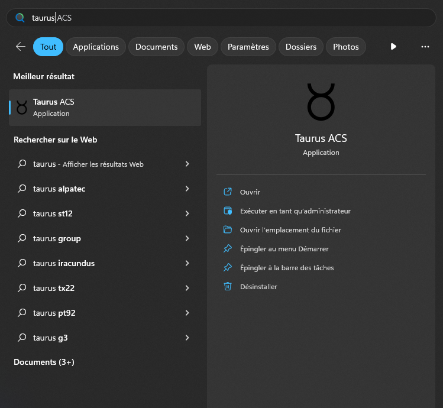

If we run the app, we can see it's just a usual login screen that requires a username and a password. The background is a nice animated space background.

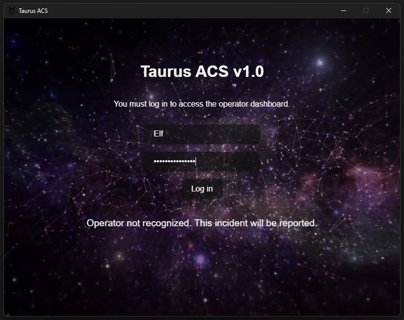

If you right click in the application, you'll see some options that refers to the web (in French on my computer, sorry).

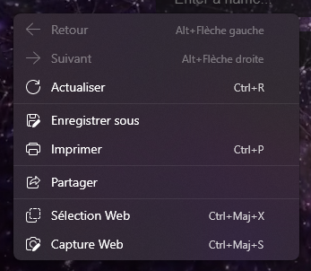

If we look closely at the UI, it indeed looks like something done with web technologies. Let's keep that in mind.

Let's find the executable. We can right click on the program in the start menu and click on "open file in folder". We see that it's actually a shortcut located in `C:\ProgramData\Microsoft\Windows\Start Menu\Programs\Taurus ACS`. If we check this time the properties of the shortcut, we can see the actual executable is located in `C:\Program Files\Taurus ACS`. \
In this folder, are only the executable itself and an uninstaller.

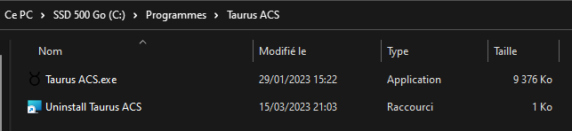

A `file` does not give much information.

```
$ file 'Taurus ACS.exe'
Taurus ACS.exe: PE32+ executable (GUI) x86-64, for MS Windows
```

Let's begin the reverse in IDA. When we open the file, the first thing we can notice is that it's written in Rust. \
Knowing that it seems to use web technologies and that the executable is Rust code, we can do some research to identify the technology used here.

We can quickly find that this is a [Tauri](https://tauri.app/) application. Tauri is basically an alternative to Electron, but much lighter, faster and secure. The front end is written with the usual web technologies you want: HTML, CSS and JavaScript, but the back end, in contrary to Electron that use node.js, is written in Rust. \
The inspiration for the name and scenario around the challenge also makes more sense now.

We have two possibilities now that we know it's a Tauri application:

- the check is done in the front end JavaScript code and we need to extract it from the application
- the check is done in the back end Rust code and we just have to find the right function to reverse

The simplest is if the check is in the back end, because even though Rust code is not that pleasing to reverse, we can just apply classic reverse strategies. If it is in the JavaScript code, then we would have to search and learn about how the front end assets are bundled in the binary and extract them. \
For this reason, let's start by reversing the executable as usual and see if the check is done somewhere here first.

Because the amount of functions is very big, as usual, we'll use the strings we know to find the interesting place. And that's a success: we find the failure string we saw earlier, and it has a x-ref to some code!

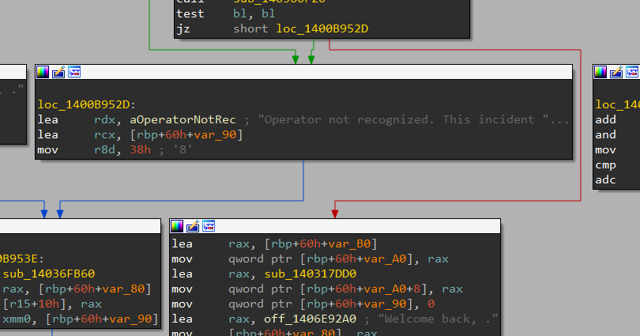

**Note** : even if placing the check in the JavaScript code would have been more interesting from a technical perspective because you have to do research on this technology, in order to keep the challenge more simple and accessible, I chose to place the check in the back end, because the challenge was initially meant to be easier than the others. Some teams still tried and succeeded in extracting the front end assets from the binary. Even if it wasn't of any use in this challenge, congrats to them!

So the check is probably done in this function, in the back end. Let's decompile it and look at what it does.

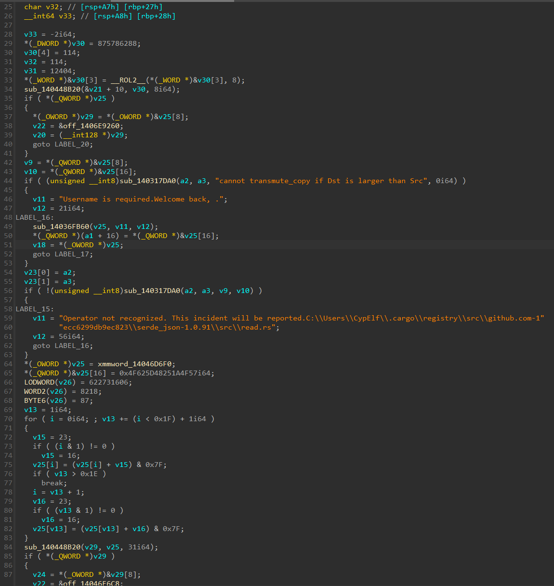

At first, it looks really, really bad. That's mainly because IDA does not properly handle Rust code and therefore wrongly identify a lot of variable types. \
But don't listen to all these people that say they see Rust reverse in their nightmares! There's a lot of things that don't matter in this decompiled content, and if you take your time to go through this and fix the wrong types, you'll see it's not that hard.

Let's split the decompiled code in two parts. Here is the first one after some time renaming and fixing stuff:

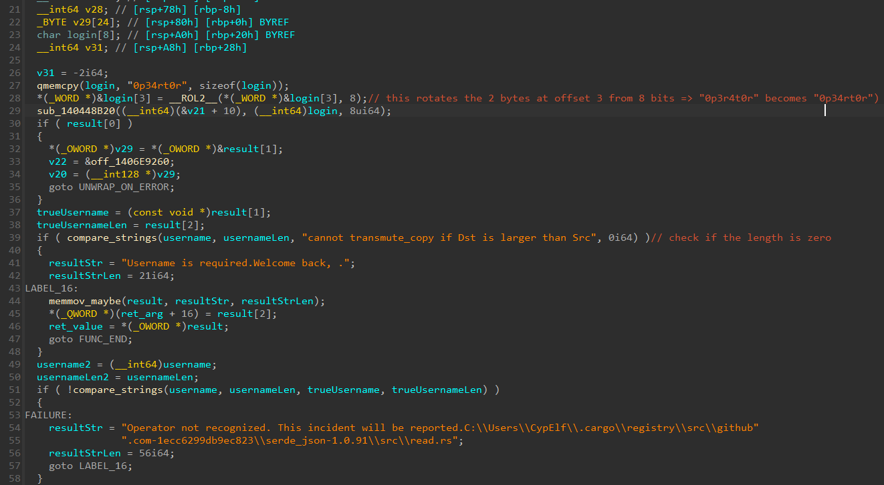

We immediately see the string `0p34rt0r` being copied into a buffer. We can guess the typo here: it should probably be `0p3r4t0r` instead. The line just after is what fixes it with a rotate left of 8 bits in the 2 bytes at offset 3, which literally just swap the two bytes `4` and `r`.

Moving on, there's some Rust complicated magic. It doesn't appear on the screenshot because it's at the end of the function, but there's a label I renamed `UNWRAP_ON_ERROR` that is used to crash the program with a panic in case with an error saying the `unwrap` method was called on an error variant. \
The first condition is therefore just a sanity check and doesn't matter for us, so we can ignore it.

The `compare_strings` function can be figured out very easily, as its code is straightforward.

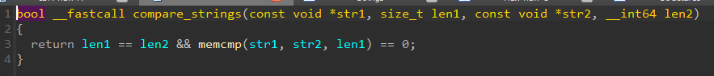

An interesting thing about Rust is that strings never end with a null byte, and are always used in pair with their length. That's the reason IDA doesn't recognize the end of strings in general when disassembling or decompiling Rust code, and why it shows us beyond the string end, when another string is placed after it.

From the error string that is inside this if block, we can deduce the variable whose length is compared to 0 is the username we entered. We already know that, so it's not a big deal.

Later, another comparison is made between our input and the one that is supposed to be right. The decompilation from IDA doesn't show at any point how the content of login at the top of the function has been moved to the result variable that is used to get the true username, but that's just IDA struggling to decompile properly. Again, by understanding the logic, you can figure out what's going on even if it's partially broken.

Moving on to the second part.

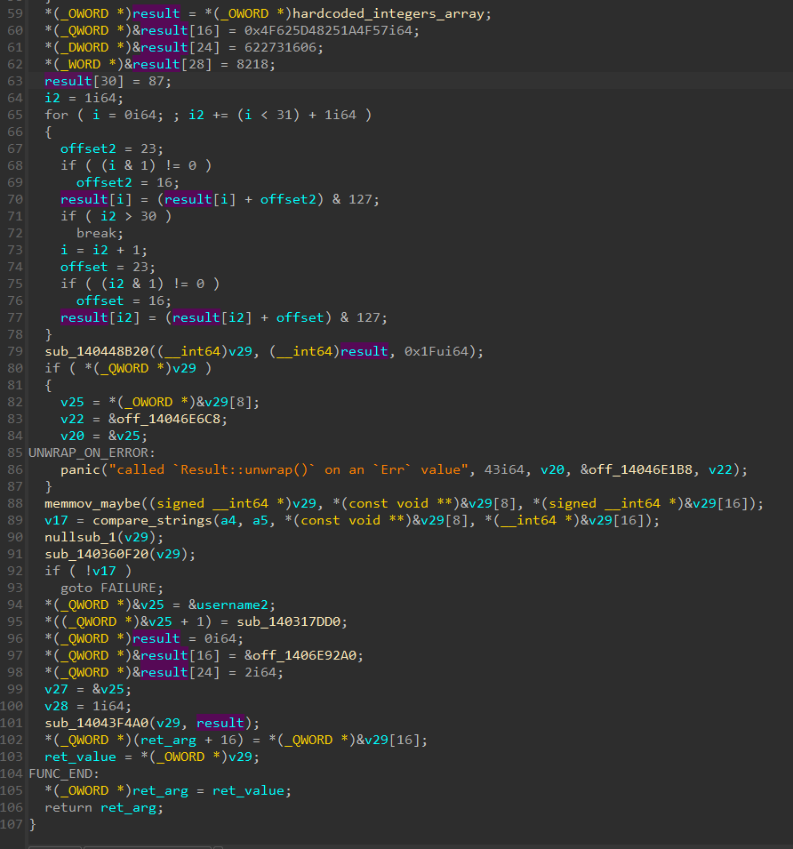

A weird thing is the fact that his `result` variable used sooner is reused for something completely different. It's really annoying because the type seems to be 64 bits in the first part, but here the variable is used as an array of bytes. \
For simplicity, I changed the type of the variable between the screenshot of the first part and this second part.

Some hardcoded bytes are placed in this buffer first. IDA detected this as a xmmword because of its size of 16 bytes, but it's probably just an optimization. I fixed the type by setting it to an array of 128 bytes to fit the decompiled code that places that in the first 16 bytes.

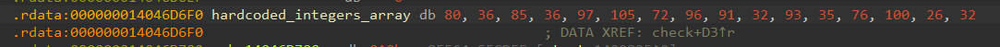

The decompiled code then places immediate values in the rest of the variable. These are probably just the next bytes condensed once again in big numbers for optimization. It stops at the 31st byte (index 30).

Next is the most important part. A loop is used to go through the buffer that was just setup. \
For each byte in that, if the loop index is odd, we apply `buffer[i] = (buffer[i] + 16) % 128`, otherwise we apply instead `buffer[i] = (buffer[i] + 23) % 128`. \
The loop actually performs this change on two bytes each time, maybe a kind of optimization once again.

At this point, no need to continue the reverse engineering work! This loop is way too suspicious. It's probably something that generate the password!

Let's extract all the hardcoded bytes and reproduce this loop in Python to see what is the output.

```py
password = [80, 36, 85, 36, 97, 105, 72, 96, 91, 32, 93, 35, 76, 100, 26, 32, 87, 79, 26, 37, 72, 93, 98, 79, 86, 33, 30, 37, 26, 32, 87]

for i in range(len(password)):
    if i % 2 == 0:
        password[i] = (password[i] + 23) % 128
    else:
        password[i] = (password[i] + 16) % 128

print("".join(map(chr, password)))
```

Result:

```
$ python3 solve.py
g4l4xy_pr0t3ct10n_15_my_m15510n
```

Nice! Let's try this as the password in the app.

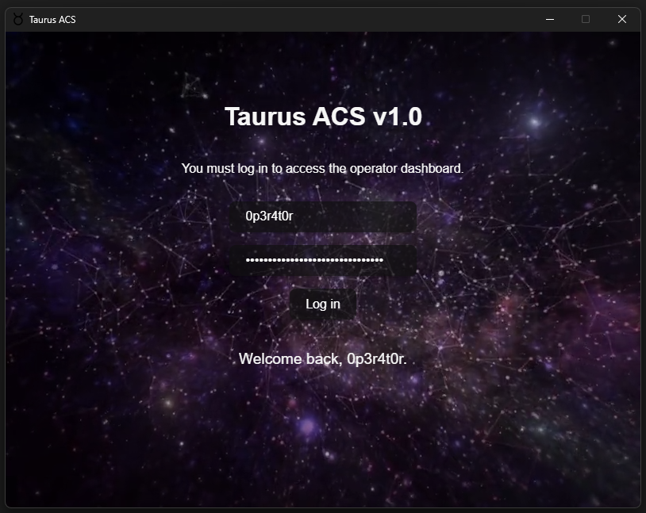

We passed the checks! \
Flag: `HACKDAY{0p3r4t0r:g4l4xy_pr0t3ct10n_15_my_m15510n}`