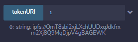
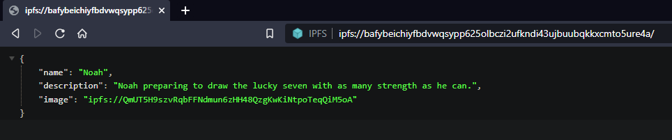
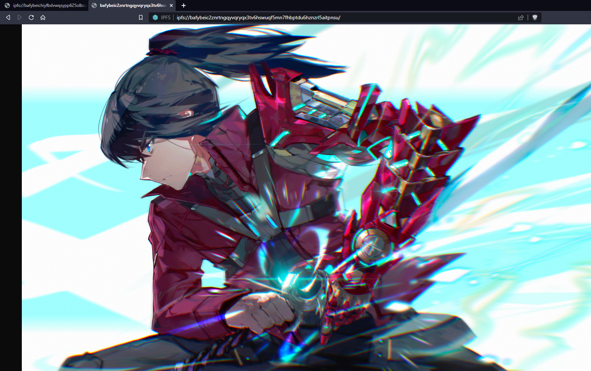
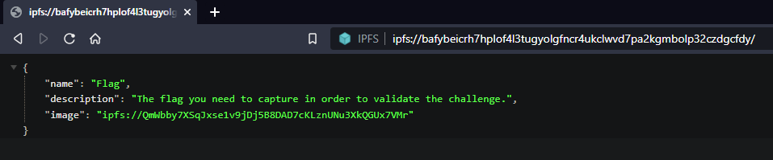
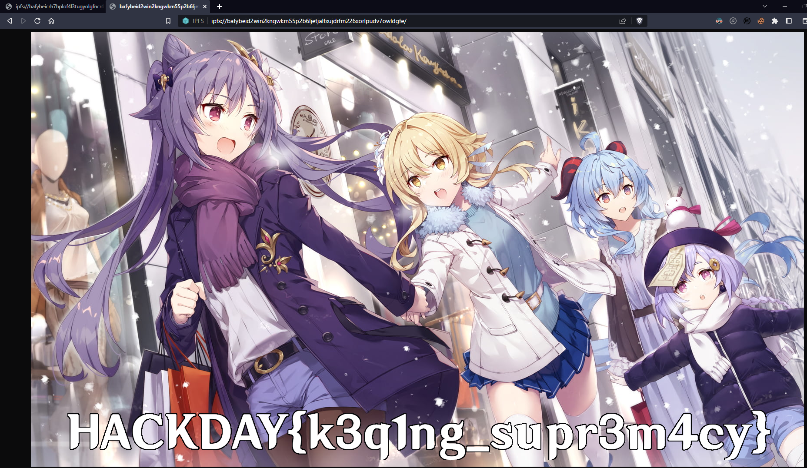

# Disclosure

> You continue your stealthy exploration of the outpost, avoiding the guards, and arrive at a server room. \
> There's bound to be some interesting data somewhere... Seize the personal data of the leaders !

We're given the following contracts:

```solidity
// SPDX-License-Identifier: Unlicensed

pragma solidity ^0.8.17;

import "@openzeppelin/contracts/token/ERC721/extensions/ERC721URIStorage.sol";
import "@openzeppelin/contracts/utils/Counters.sol";

// The following contract is vulnerable on purpose: DO NOT COPY AND USE IT ON MAINNET!
contract FilesManager is ERC721URIStorage {
    using Counters for Counters.Counter;
    Counters.Counter private tokenIds;
    address public owner;
    string public ownerName;

    constructor(string memory _name, address _owner) ERC721("Files", "FLS") {
        ownerName = _name;
        owner = _owner;
    }

    function mintNewToken(string memory metadataUri) public {
        require(msg.sender == owner);
        tokenIds.increment();
        uint256 newId = tokenIds.current();
        _mint(owner, newId);
        _setTokenURI(newId, metadataUri);
    }
}
```

```solidity
// SPDX-License-Identifier: Unlicensed

pragma solidity ^0.8.17;

import "./FilesManager.sol";

// The following contract is vulnerable on purpose: DO NOT COPY AND USE IT ON MAINNET!
contract FilesManagerDeployer {
    function createNewFileManagerFor(string memory name) public returns(address) {
        return address(new FilesManager(name, msg.sender));
    }
}
```

## Goal

We start only with the address of a FilesManagerDeployer. As the description of the challenge suggests, our goal is to leak some interesting data. \
The FilesManagerDeployer contract is literally just doing what the name implies: deploying a FilesManager contract on demand. \
The FilesManager contract is a contract that holds NTFs for someone. \
Let's recover the FilesManager contracts deployed by the FilesManagerDeployer for the leaders, and see what NFTs they own!

## Recover the FilesManager instances

One could think that when a smart contract is deployed by another one, it gets a random address... But actually, it doesn't! \
Instead, the new contract created gets an address computed from the current smart contract address and a nonce that is incremented after each contract creation, starting at 1.

Here is how the formula looks like:

```
new_contract_address = 20_rightmost_bytes(keccak256(rlp(contract_address, nonce)))
```

With `20_rightmost_bytes` a function that returns the 20 last bytes of its input and `rlp` a function that does [RLP encoding](https://ethereum.org/en/developers/docs/data-structures-and-encoding/rlp/).

For convenience, we can use in JavaScript the `getContractAddress` from the npm package `@ethersproject/address` to do the computation for us. \
After computing the addresses and checking if there's indeed a contract located at each address, we can conclude that 3 contracts have been deployed.

```js
const { getContractAddress } = require("@ethersproject/address")

const deployerAddress = "<contract address here>"

for (let i = 1; i <= 3; i++) {
    const deployedAddress = getContractAddress({
        from: deployerAddress,
        nonce: i
    })

    console.log(`Contract number ${i} is deployed at ${deployedAddress}`)
}
```

There are also online websites for this, e.g. [ABDK Toolkit](https://toolkit.abdk.consulting/ethereum#contract-address).

## Inspect the NFTs

Now that we know the addresses of these contracts, let's go ahead and access the NTFs stored on each of them! The FilesManager contract implements OpenZeppelin's `ERC721URIStorage` interface, so we can use the `tokenURI` function to get the URI associated to a token. \
Let's start with the first contract. If we call `tokenURI` on the token ID 1 to get the URI associated to the first NTF this contract owns, we get the URI `TODO`. The URI starts with `ipfs://`: this NFT is stored on IPFS!



[IPFS](https://ipfs.tech/) is a peer to peer hypermedia and file sharing protocol similar to BitTorrent, that aims to be an decentralized alternative to today's web and HTTP. Content on IPFS is not accessed using its location as is the case with HTTP, but by a content identifier (CID) that uniquely identifies the content.

We can access this IPFS link to see the file it points to on the IPFS network. For this, we can use a public IPFS gateway directly from our browser using HTTP, such as `https://ipfs.io/ipfs/<CID>` or `https://dweb.link/ipfs/<CID>`. \

**Note** : if you use the [Brave](https://brave.com/) browser, IPFS is supported out of the box and you can just paste the IPFS link in the URL top bar to access the file. Brave will ask you if you want to use a public gateway or directly start your own IPFS node in the browser so you can access the file using the IPFS protocol without using a third party.



NFTs with Ethereum often use this pattern to store data about the token: the NFT in the Ethereum chain points to a JSON metadata file on IPFS, used to store data such as a name, a description, and more... \
In addition, we can see an image field, with once again another IPFS link. This is typically used to store illustrations associated to a NFT. \
If we access it, we get a very nice fan art from Xenoblade Chronicles 3.



If we repeat the process and go through all the NTFs one by one, we see that they all follow the same schema. Each of them is linked to a JSON metadata file on IPFS, which in turn is linked to an illustration, also on IPFS.

After inspecting all the NFTs of the contracts, in the 3rd one, we finally find a NTF whose metadata indicate the name `Flag`.



And that's it, the flag is written on the image.



Flag: `HACKDAY{k3q1ng_supr3m4cy}`