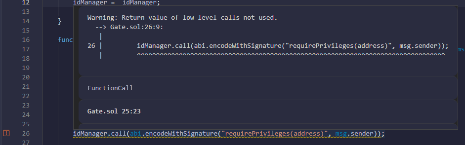
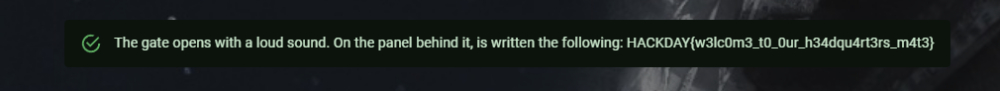

# Gate

> As you arrive at the outpost, you find that the main entrance at the front is completely guarded, but as you walk around the area, you find a small hidden service door that leads straight into the outpost.
> 
> Only problem, this one is armored and doesn't seem to allow you to pass... Find your way in!

We're given the following contracts:

```solidity
// SPDX-License-Identifier: Unlicensed

pragma solidity ^0.8.17;

// The following contract is vulnerable on purpose: DO NOT COPY AND USE IT ON MAINNET!
contract IdentityManager {
    mapping(address => string) private identities;
    mapping(address => bool) private privileged;

    constructor() {
        privileged[msg.sender] = true;
    }

    function setMyIdentity(string memory name) public {
        identities[msg.sender] = name;
    }

    function setIdentityFor(address addr, string memory name) public {
        requirePrivileges(msg.sender);
        identities[addr] = name;
    }

    function setPrivileged(address addr) public {
        requirePrivileges(msg.sender);
        privileged[addr] = true;
    }

    function requirePrivileges(address addr) public view {
        require(privileged[addr]);
    }

    function getIdentity(address id) public view returns(string memory) {
        return identities[id];
    }
}
```

```solidity
// SPDX-License-Identifier: Unlicensed

pragma solidity ^0.8.17;

// The following contract is vulnerable on purpose: DO NOT COPY AND USE IT ON MAINNET!
contract Gate {
    address public idManager;
    uint8[] private password;
    bool public gateLocked = true;

    constructor(address _idManager, uint8[] memory _password) {
        idManager = _idManager;
        password = _password;
    }

    function letMeIn(string memory _password) public returns(string memory) {
        (bool success, bytes memory result) = idManager.call(abi.encodeWithSignature("getIdentity(address)", msg.sender));
        require(success);
        string memory name = abi.decode(result, (string));
        bytes memory passbytes = bytes(_password);

        // user must be registered with a name
        require(bytes(name).length > 0 && passbytes.length == password.length);

        // user must be privileged
        idManager.call(abi.encodeWithSignature("requirePrivileges(address)", msg.sender));
        
        // user must know our secret password
        for (uint256 i = 0; i < password.length; i++) {
            require(password[i] == uint8(passbytes[i]));
        }

        gateLocked = false;
        return string.concat("Welcome, ", name);
    }
}
```

## Goal

Our goal seems to unlock the door, so we have to change the value of the variable `gateLocked` from the Gate contract to `false`.

With the `letMeIn` function, we can unlock the contract if we match 3 conditions:

- we have to be registered with a name
- we must be a privileged user
- we must know the secret password

Let's dive in each part one after the other.

## Register with a name

This part is pretty straightforward. A call is made to the IdentityManager contract to check if the user has a registered name:

```solidity
(bool success, bytes memory result) = idManager.call(abi.encodeWithSignature("getIdentity(address)", msg.sender));
```

To register a name in this contract, we just have to call the function made for this purpose, `setMyIdentity`, with any name we want. Easy.

## Bypass the privileges check

This part is even easier, because... We actually don't have to do anything to pass this! \
A call is made to the `requirePrivileges` function, but the return values aren't used! A particularity of the `call` function is that in case of a failure, it doesn't revert the transaction immediately. Instead, a boolean value is returned to indicate the success of the call. \
You can see a few lines above that the call to `getIdentity` did return a boolean value in addition to the result of the function, and that the contract asserted that this boolean indicating a success was true before continuing. There should be the same check here, but it isn't done! \
This means that even if the require fails in the IdentityManager, the transaction won't be reverted because the result of the call is unused, allowing the execution to continue.

**Note** : If you paste the contract code into Remix, you'll see it even warns you about the fact that the return value isn't used! Thanks, Remix!



## Finding the password

A key principle behind blockchains in general is to have everything public to anyone. If you go to the [Solidity documentation](https://docs.soliditylang.org/en/v0.8.17/contracts.html#state-variable-visibility), you'll see inside a big warning box a very interesting information:

> Making something private or internal only prevents other contracts from reading or modifying the information, but it will still be visible to the whole world outside of the blockchain.

Indeed, in Solidity, `public` means that a getter for the variable will be added to allow external accounts to easily see the variable value, while `private` just doesn't create a getter. But the value in the private variable is still accessible, because as everything is public, you can inspect the storage of the contract and find everything in it.

The storage in the [EVM](https://ethereum.org/en/developers/docs/evm/) is where every state variable is stored. This storage is divided in slots that start at index 0. \
EVM programs can use this storage however they want. For this reason, [Solidity has established a convention](https://docs.soliditylang.org/en/v0.8.17/internals/layout_in_storage.html) they use to decide in which slot each variable will go. Each small fixed type, such as address and uint types among others, are just stored contiguously from index 0. \
But in our case, the password is defined as an array of `uint8`.

```solidity
uint8[] private password;
```

From the Solidity documentation, arrays are stored using the following method:

> Array data is located starting at keccak256(p) and it is laid out in the same way as statically-sized array data would: One element after the other, potentially sharing storage slots if the elements are not longer than 16 bytes.

Because the address of the IdentityManager is stored before the array, we know the array itself is located in slot 1. \
We can therefore use `ethers.js` to inspect the array slots and extract the bytes from it:

```js
const { providers, utils, BigNumber } = require("ethers")

async function main() {
    const contractAddress = "<contract address here>"
    const arraySlot = 1

    const provider = new providers.JsonRpcProvider("http://sie2op7ohko.hackday.fr:8545")

    for (let i = 0; i < 2; i++) {
        const slotValue = await provider.getStorageAt(contractAddress, (BigNumber.from(utils.solidityKeccak256(["uint256"], [arraySlot]))).add(i).toHexString())
        console.log(slotValue)
    }
}

main()
```

Because the array is storing uint8, a lot of them are concatenated together in the same slot to optimize the storage usage.

```
$ node .\script.js
0x65316b7320746867316e20336874206e3120743575647234747320796e316873
0x0000000000000000000000000000000000000000000000000000000000000073
```

If we convert `0x7365316b7320746867316e20336874206e3120743575647234747320796e316873` from hex to ASCII and reverse the string (because the bytes are stored in little endian), we get the password: `sh1ny st4rdu5t 1n th3 n1ght sk1es`.

## Get the flag

Now that we have registered our name, understand that we can ignore the permission check and recovered the password, we can call the `letMeIn` function with the argument `sh1ny st4rdu5t 1n th3 n1ght sk1es` to unlock the gate! \
Only thing left to do is to click the check button and get the flag.



Flag: `HACKDAY{w3lc0m3_t0_0ur_h34dqu4rt3rs_m4t3}`